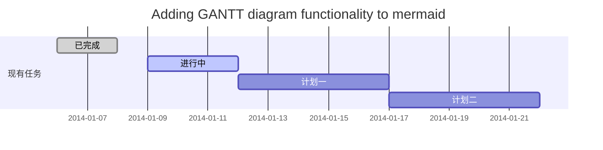
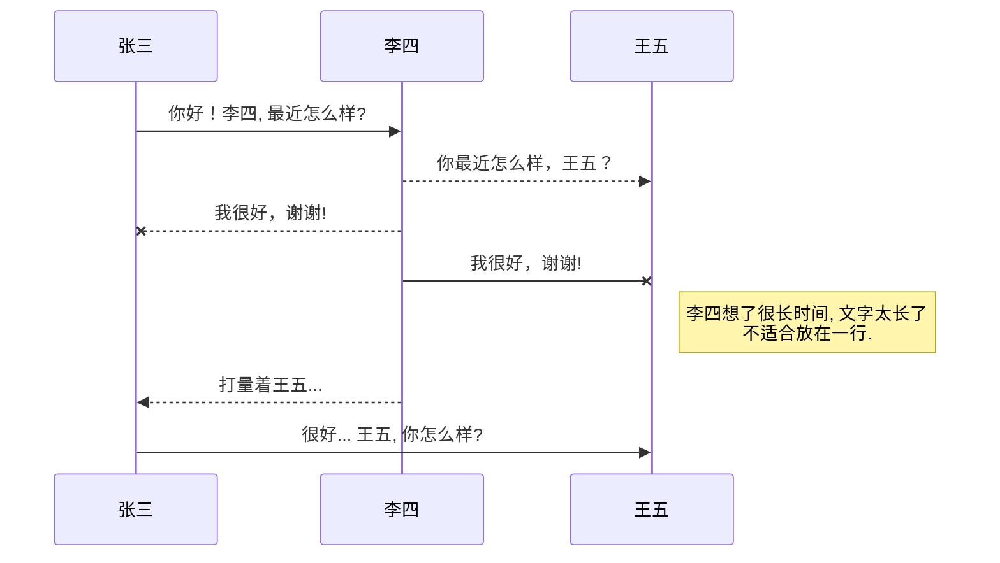
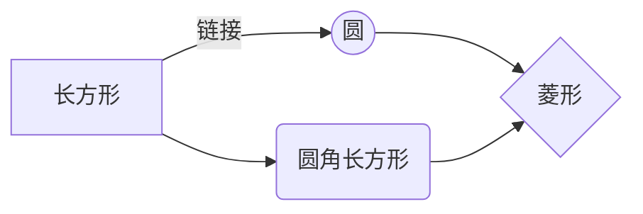


@[TOC](LoRaWAN 1.1 协议介绍)

# 第一章	介绍
LoRaWAN是针对电池供电的终端进行优化的一套网络协议
- 星型拓扑结构
- **网关**负责转发终端和后端网络服务器的消息
- 采用**对称加密**
	
网关通过安全的标准IP连接连接到网络服务器，而终端设备使用单跳LoRa™或FSK通信连接到一个或多个网关。 尽管从终端设备到网络服务器的上行链路通信预计是主要流量，但所有通信通常都是双向的。
终端设备和网关之间的通信分布在不同的频率信道和数据速率上。 数据速率的选择是通信范围和消息持续时间之间的折衷，具有不同数据速率的通信不会相互干扰。 LoRa数据速率范围从0.3 kbps到50 kbps。 为了最大限度地延长终端设备的电池寿命和整体网络容量，LoRa网络基础设施可以通过自适应数据速率（**ADR**）方案单独管理每个终端设备的数据速率和RF输出。
只要遵守以下规则，终端设备可以使用任何可用的数据速率随时在任何可用的信道上进行传输：
- 终端设备为每次传输以伪随机方式改变信道。 由此产生的频率分集增强系统对干扰的鲁棒性。
- 终端设备要遵守相应频段和本地规定中的最大发射占空比。
- 终端设备要遵守相应频段和本地规定中的最大发射时间。


## LoRaWAN Classes
所有LoRaWAN设备必须至少实现本文档中描述的A类功能，另外也可以实现文档中描述的B和C类功能。
MAC命令的格式写作 ***LinkCheckReq*** (***粗斜体***)，位和位域的格式写作 **FRMPayload** (**粗体**)，常量的格式写作 RECEIVE_DELAY1，变量的格式写作 N。
- 所有多字节字段的字节序均采用小端模式
- EUI是8字节的多字节字段，并以小端传输
- 默认情况下，RFU位发送时设置为零，接收器忽略


# 第二章	LoRaWAN Classes类型介绍
LoRa 是由Semtech面向长距离、低功耗、低速率应用而开发的无线调制技术，实现A类以上的设备通常在本文档中称为“更高级的终端设备”。
## LoRaWAN Classes
LoRa网络区分基本LoRaWAN（名为A类）和可选功能（B类，C类）：

- **双向传输终端设备（Class A）：** A类终端设备允许双向通信，其中每个终端设备的上行链路传输之后是两个短的下行链路接收窗口。 由终端设备调度的传输时隙基于其自身的通信需求，具有基于随机时间基础的小变化（ALOHA类型的协议）。 对于仅在终端设备发送上行链路传输之后不久需要来自服务器的下行链路通信的应用，该A类操作是最低功率的终端设备系统。 在任何其他时间从服务器进行的下行链路通信将不得不等到下一个预定的上行链路。
- **具有预定接收时隙的双向终端设备（Class B）：** B类终端设备允许更多接收时隙。 除了A类随机接收窗口外，B类设备还会在预定时间打开额外的接收窗口。 为了使终端设备在预定时间打开其接收窗口，它从网关接收时间同步的信标。
- **具有最大接收时隙的双向终端设备（Class C）：** C类终端设备几乎连续打开接收窗口，仅在发送时关闭。 C类终端设备将比A类或B类使用更多电力，但它们为服务器到终端设备通信提供最低延迟。
所有LoRaWAN终端设备必须实现A类功能。
# 第三章 	PHY帧格式
LoRa区分上行链路消息和下行链路消息

## 上行消息
上行链路消息由终端设备发送到由一个或多个网关中继的网络服务器。

上行链路消息使用LoRa显式模式，其中包括LoRa物理报头（**PHDR**）加上报头**CRC**（**PHDR_CRC**）。有效载荷的完整性受**CRC**保护。

**PHDR**，**PHDR_CRC** 及载荷 **CRC** 域都通过射频收发器加入。

Uplink PHY:
Preamble | PHDR | PHDR_CRC | PHYPayload | CRC
------- | ------- | ------ | ---- | ------ |
## 下行消息
每个下行链路消息由网络服务器仅发送到一个终端设备，并由单个网关中继。

下行链路消息使用LoRa显式模式，其中包括LoRa物理头（PHDR）和头CRC（PHDR_CRC）。

Downlink PHY:
Preamble | PHDR  | PHDR_CRC  | PHYPayload
---- | ----- | ------ | ---- | 
## 接收窗口
在每次上行链路传输之后，终端设备**必须**打开两个短接收窗口。 接收窗口开始时间根据传输结束的时间作为参考定义。

### 第一个接收窗口通道，数据速率和启动
RX1使用的频率和上行频率有关，存在对应关系，RX1使用的速率和上行速率对应。在上行链路调制结束后，RX1 打开 RECEIVE_DELAY 1 秒（+/- 20微秒）。 上行链路和RX1时隙下行链路数据速率之间的关系是**区域特定**的并且在[PHY]中详述。 默认情况下，第一个接收窗口数据速率与上一个上行链路的数据速率相同。
### 第二个接收窗口通道，数据速率和启动
RX2使用**固定**的可配置频率和数据速率在上行链路调制结束后，打开 RECEIVE_DELAY2 1 秒（+/- 20微秒）。使用的频率和数据速率可以通过MAC命令修改（参见第5节）。 要使用的默认频率和数据速率是**特定于区域**的，并在[PHY]中详细说明。

### 接收窗口的持续时间
接收窗口的长度**必须**至少是终端设备的无线电收发器有效检测下行链路前导码所需的时间。
### 接收窗口期间接收方的活动
如果在一个接收窗口期间检测到前导码，则保持接收直到解调下行链路帧。 如果在第一个接收窗口期间检测到帧并随后进行了解调，并且该帧用于**地址**和**MIC**（消息完整性代码）检查后的终端设备，则终端设备**不得**打开第二个接收窗口。
### 网络向终端设备发送消息
如果网络打算将下行链路发送到终端设备，它必须在两个接收窗口中的至少一个的开始处**精确**地发起传输。 如果在两个窗口期间发送下行链路，则**必须**在每个窗口期间发送**相同**的帧。
### 接收窗口的重要通知
终端设备在其已经在先前传输的第一或第二接收窗口中接收到下行链路消息或者先前传输的第二接收窗口到期之前不发送另一上行链路消息。
### 接收或传输其他协议
节点可以监听或传输其他协议或在LoRaWAN传输和接收窗口之间进行任何无线电交易，只要终端设备保持与本地规则兼容并符合LoRaWAN规范。

# 第四章	MAC帧格式
所有LoRa上行链路和下行链路消息携带PHY有效载荷（有效载荷），以**1**个字节MAC头（**MHDR**）开始，随后是MAC有效载荷（**MACPayload**），并以**4**字节消息完整性代码（**MIC**）结束。
射频PHY层：

| Preamble | PHDR  | PHDR_CRC | PHYPayload  | CRC
| ----- | ----- | ------ | ----| -----|
**注意CRC只有上行链路消息中存在**

**PHYPayload：**
| MHDR | MACPayload | MIC | 
| --------- | ----------------- | ------ |
or
| MHDR | Join-Request or Rejoin-Reques | MIC | 
| --------- | ----------------- | ------ |
or
| MHDR | Join-Accept |
| --------- | --------------- |
对于**Join-Accept帧**，MIC字段使用有效负载加密，而不是单独的字段

**MACPayload：**
| FHDR | FPort  | FRMPayload |
| ----- | ---- | -----|
**FHDR：**
| DevAddr | FCtr | FCnt | FOpts |
| ----- | ----- | ------ | ------ |
## MAC层（PHYPayload）
| Size (bytes) | 1 | *7..M* | 4 | 
| --- | --- | ---- | ---- |
| PHYPayload | MHDR  | MACPayload | MIC | 
**MACPayload**字段的最大长度（**M**）是特定于区域的，在第6章中详细说。

## MAC头（MHDR字段）
| Bit# | *7..5* | *4..2* | *1..0* | 
| ----- | ----- | ----- | ---- |
| MHDR bits | MType | RFU | Major |
MAC报头指定消息类型（**MType**），并根据LoRaWAN层规范的帧格式的主要版本（**Major**）对帧进行编码。
### 消息类型（MType）
LoRaWAN定义了六个不同的MAC消息类型：join request, join accept, unconfirmed data up/down, 以及 confirmed data up/down 。
| MType | 描述 | 
| ----- | ----- | 
| 000|Join Request | 
| 001 | Join Accept |
| 010 | 	Unconfirmed Data Up | 
| 011 | Unconfirmed Data Down|
|100  | Confirmed Data Up |
|101  | Confirmed Data Down|
|110|	RFU|
|111	|Proprietary|
#### Join-request and join-accept messages
用于OTAA（ *over-the-air activation*）
#### Data messages
Confirmed-data message 必须由接收方确认。
Unconfirmed-data message 接收者则不需要应答。
Proprietary messages 用来处理非标准的消息格式，不能和标准消息互通，只能用来和具有相同拓展格式的消息进行通信。
当终端设备或网络服务器收到未知的专有消息时，会以静默方式丢弃。
对于不同的消息类型，以不同的方式确保消息完整性。
## 数据消息的主版本（Major）
| Major bits | Description | 
| ---- | ----|
| 00 | LoRaWAN R1 |
| 01..11 | RFU | 
> 终端要根据不同的主版本号实现不同最小版本的消息格式。终端使用的最小版本应当提前通知网络服务器。当服务器接收到的消息帧格式携带未知的版本号，会选择静默方式丢弃。
### 数据消息的MAC Payload（MACPayload）
MAC载荷，也就是所谓的“数据帧”，包含：帧头（FHDR）、端口（FPort）以及帧载荷(FRMPayload），其中端口和帧载荷是可选的。
### 帧头（FHDR）


## 新的甘特图功能，丰富你的文章


- 关于 **甘特图** 语法，参考 [这儿][2],

## UML 图表

可以使用UML图表进行渲染。 [Mermaid](https://mermaidjs.github.io/). 例如下面产生的一个序列图：:



这将产生一个流程图。:



- 关于 **Mermaid** 语法，参考 [这儿][3],

## FLowchart流程图

我们依旧会支持flowchart的流程图：
```mermaid
flowchat
st=>start: 开始
e=>end: 结束
op=>operation: 我的操作
cond=>condition: 确认？

st->op->cond
cond(yes)->e
cond(no)->op
```

- 关于 **Flowchart流程图** 语法，参考 [这儿][4].


## 导出与导入

###  导出
如果你想尝试使用此编辑器, 你可以在此篇文章任意编辑。当你完成了一篇文章的写作, 在上方工具栏找到 **文章导出** ，生成一个.md文件或者.html文件进行本地保存。


### 导入
如果你想加载一篇你写过的.md文件或者.html文件，在上方工具栏可以选择导入功能进行对应扩展名的文件导入，
继续你的创作。

 [1]: http://meta.math.stackexchange.com/questions/5020/mathjax-basic-tutorial-and-quick-reference
 [2]: https://mermaidjs.github.io/
 [3]: https://mermaidjs.github.io/
 [4]: http://adrai.github.io/flowchart.js/
